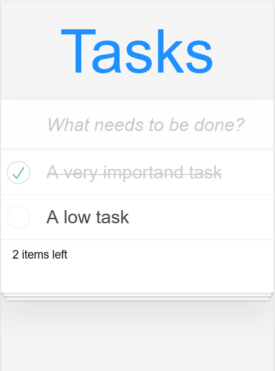

# Tasks Application
This is an example project with the following technologies:
* Gradle
* Angular
* Rest
* SpringBoot
* JsonDB

## Requirements
I develop on Windows with the Ubuntu Bash, so if you work on other OS, the commands could be different. The version in brackets is the version with which I developed.
* Java (11.0.6)
```bash
apt-get install default-jdk
```
* Node (v10.19.0) and npm (6.13.7):
```bash
curl -sL https://deb.nodesource.com/setup_10.x | sudo -E bash -
sudo apt-get install nodejs
```
* Angular CLI (1.7.4)
```bash
 npm install -g @angular/cli@1.7.4
```
Gradle (6.1.1)
```bash
sudo apt install gradle
```

## Impressions
Desktop Version                                 |  Mobile Version
:----------------------------------------------:|:----------------------------------------------:
  |  

# Run Application
1 - You should build the project with gradle and download dependencies:
```bash
sh 01-build.sh
```
or
```bash
sh ./gradlew build
```
2 - Start the Application (Spring Boot + Angular UI):
```bash
sh 02-start.sh
```
or
```bash
cd tasks-backend && ./gradlew bootRun
cd tasks-ui && ng serve
```
3 - Now you can open the Application
```bash
sh 03-open.sh
```
or if you do not have the Windows Ubuntu Bash and Firefox, open the site in a browser:
```bash
http://localhost:4200/
```

### Remarks
I develop on Windows Home System, so I can not start Docker, because Docker needs Hyper-V Support which Windows Home not have. So I choose JsonDB (and not MongoDB), 
also with the idea that it will be a cross-functional application (Smartphone-App + Desktop-App).

### References
* For the styling  I used TodoMVC CSS (https://github.com/tastejs/todomvc-app-css)
* For the database I used JsonDB (http://jsondb.io/)